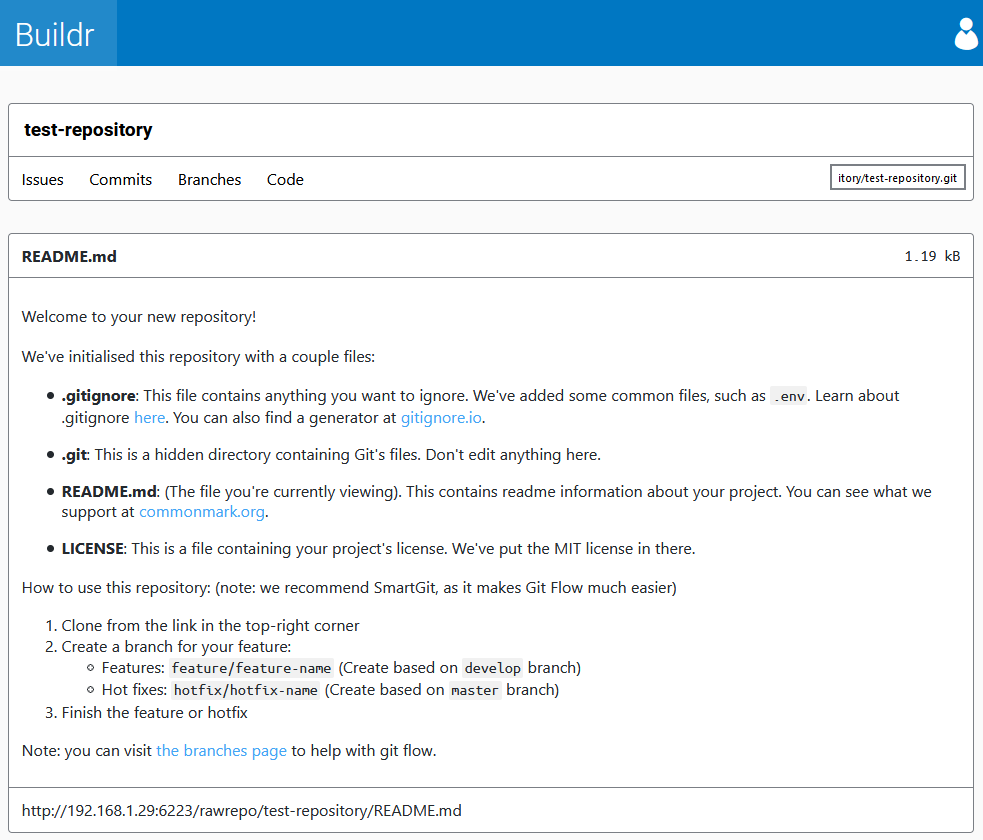

# Buildr
> Git repository hosting and CI tool
   



Buildr is a two part website (a statically hosted front-end and a NodeJS backend) that contains all the parts 
required in DevOps.

Features:

 - Repository viewer
   - Issues browser
   - Merge/PR support
   - Markdown support
   - Support for any language supported by highlightjs
   - Raw file accessing (with incorrect content-type)
   - Commits viewer with diffs
   - Multi-branch support, with GitFlow support
 - Continuous integration tool
   - Directly linked with repository viewer - no configuration files needed
   - Support for Linux, Windows and Mac
   - Deploy directly from repository viewer
   - Generate change logs automatically

## Setting up

1. Download `bundle.zip` the [latest release](releases).
2. Installing the server:
   1. Copying files:
      - If you want an exe to run the backend, copy `backend.exe` and `configuration.json` to your target directory.
      - If you want to use NodeJS to run the backend, copy the contents of `backend-node/` and `configuration.json` to 
      your target directory.
   2. Make sure that the configuration matches your settings.
   3. Run either the EXE or `yarn start` in the directory you copied everything to.
3. Installing the client:
   1. Open the `frontend/` folder.
   2. Remove the `dist/` and `.cache/` directories if they exist.
   3. Run `build.bat` or `build.sh` (depending on your system) or `yarn run prod`.
   4. Copy the contents of `dist/` to your server. Make sure that it is at a root path.
   5. Make sure that the backend configuration of the frontend matches your server.
   
## Development Setup

```bash
git clone https://github.com/Zoweb/Buildr
cd Buildr

# Set up client
cd Client
yarn install

# Set up server
cd ../Server
yarn install
```

```bash
# Start client, in /Client
yarn run dev
```


```bash
# Start server, in /Server
yarn run dev
```

## Contributing

1. [Fork it](fork)
2. Create the branch:
   - Features: `feature/foo-bar`
   - Hot-Fixes: `hotfix/foo-bar`
   - Support: `support/foo-bar`
3. Commit your changes
4. Push the branch
5. Create a PR

## License
Licensed under the MIT license. See the LICENSE file for more details.